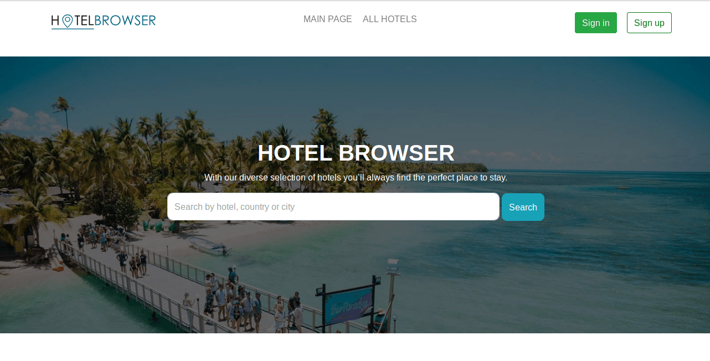

# Hotel Browser

> With our diverse selection of hotels you’ll always find the perfect place to stay.

Hotel Browser allows you to read reviews of hundreds of hotels, compare hotel ratings, give hotel reviews. All these features help our users to choose the best places for holiday or business trip.

## Usage example

If you want view the best hotels according to users of our site, you just should open our site home page. There is "Top 5" block which contains 5 hotels with the highest rating. 

Also you can use search line to find specific hotel you are interested in or go on "All hotels" page to see paginated list of all hotels. The search is conducted by the field "name", "country", "city" that allows you to choose the most suitable hotel with the best rating.

You can push "Show" button to open hotel page contains all hotel information including location, room types and prices, breakfast, users reviews and ratings. If you logged in you also can participate in our rating system and give a review to hotels. If your opinion has changed you should remove your old review and write a new one.

Our users also can add new hotels in database or update room types and prices. It makes our database dynamic and regularly updated.
